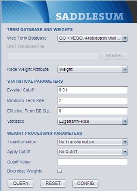
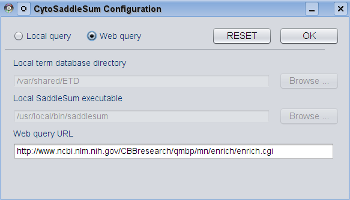
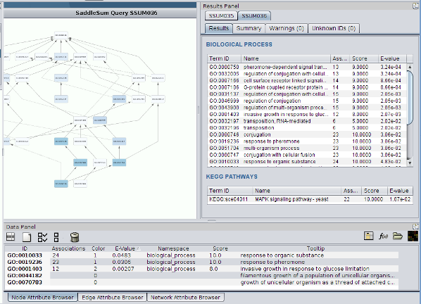

Cytoscape Plugin
================

*CytoSaddleSum* is a Cytoscape plugin that provides interface to *SaddleSum*
functionality. It works by querying *SaddleSum* either locally (using the
standalone version) or remotely, through an HTTP request to a web server. The
results of a functional enrichment query are shown as a term relationship
network, where nodes represent terms linked by edges showing term
relationships. The statistics and other query details for each term are
written as node attributes. This allows easy integration of *SaddleSum* into a
network-based data analysis workflow.

*CytoSaddleSum* was developed for Cytoscape version 2.8. All the source code
written a the NCBI is released into public domain.

Downloading and Installing
--------------------------

It is possible to download *CytoSaddleSum* either as a JAR file ready for
installation as a Cytoscape plugin or as zipped source code archive. Both can
be found on the NCBI FTP site (ftp://ftp.ncbi.nih.gov/pub/qmbpmn/CytoSaddleSum/).
Releases of *CytoSaddleSum* share version numbers with other *SaddleSum*
interfaces, starting with 1.4.

To install *CytoSaddleSum*, copy the JAR file you have downloaded to the
plugins subdirectory of your Cytoscape distribution. If the installation
location was correct, you would see the **SaddleSum** entry in the Cytoscape
**Plugins** menu.

Building from Source
--------------------

The source code was mostly developed using `NetBeans <http://www.netbeans.org/>`_
and built using `Apache Ant <http://ant.apache.org/>`_. To build the JAR file,
you first need to unzip the source distribution file, put ``cytoscape.jar`` onto
your CLASSPATH and copy the file ``build.xml.git`` in the root of the
distribution to ``build.xml``. Then type::

  ant package

to build the JAR named ``CytoSaddleSum.jar`` in the root distribution
directory.

Using CytoSaddleSum
-------------------

Starting plugin from Cytoscape
^^^^^^^^^^^^^^^^^^^^^^^^^^^^^^

Start *CytoSaddleSum* by choosing the Cytoscape menu entry
:menuselection:`Plugins --> CytoSaddleSum --> Query Form`.
After reading the configuration file (see below), *CytoSaddleSum*
attempts to retrieve the list of available term databases that can be
selected for a query. After that, it creates a query form and inserts
it into the Cytoscape Control Panel (on the left of the Cytoscape
window). You may need to resize the Control Panel to see the entire
*SaddleSum* query form.

The query form has a look and functionality similar to the query form of
*SaddleSum* web interface. Three action buttons can be found at its bottom:

* QUERY - to start running a *SaddleSum* query (see :ref:`query-label`);
* RESET - to reset the form;
* CONFIG - to change *CytoSaddleSum* configuration (see :ref:`config-label`).
* LOAD - to load *CytoSaddleSum* results saved as attributes in a term relationship graph (see :ref:`restore-label`).

.. _config-label:

Configuration
^^^^^^^^^^^^^

Configuration of *CytoSaddleSum* is handled though a separate dialog.

There are two possible configurations:

Web Query
   This option will configure *CytoSaddleSum* to query the *SaddleSum* web
   service over HTTP. Choosing this method means that you are not
   required to download, compile or configure the command-line
   version of *SaddleSum*. You may notice some latency when
   starting and running *CytoSaddleSum* and you will not be able to use custom
   GMT formatted term databases.

Local Query
   This option will configure *CytoSaddleSum* to run a local
   program. Choosing this method means that you need to download and
   compile the command-line version of *SaddleSum*. Queries will be generally
   faster and it will be possible to use custom GMT databases as well as
   ETD databases downloaded from the *SaddleSum* FTP site.

Configuring for web queries
"""""""""""""""""""""""""""

Configuring *CytoSaddleSum* to perform a web query requires
clicking the "Web query" radio button and
entering the URL for the *SaddleSum* web services into the "Web query URL" box.

.. note:: When creating the initial configuration, *CytoSaddleSum* will automatically set
  the URL of the default *SaddleSum* web service in the "Web query URL" box and
  this need not to be changed unless the server address changes.

Configuring for local queries
"""""""""""""""""""""""""""""

Configuring *CytoSaddleSum* to perform a local query requires more work
than configuring it to perform a web query. First, you need to download,
compile and install the standalone *SaddleSum* (see :ref:`standalone-label`)
and, optionally, some ETD databases that you may use. In the configuration
dialog you need to click the "Local query" radio button and set the paths for:

* The SaddleSum binary (for example ``/usr/local/bin/saddlesum``)
* The directory holding downloaded ETD files.

.. note:: *CytoSaddleSum* assumes that the second binary from the standalone package
  (``saddlesum-show-etd``) can be located in the same directory as ``saddlesum``.

.. note:: Downloading ETD files is optional but if none are present in the
  specified directory, only local queries using custom GMT term databases will
  be enabled.

.. _query-label:

Setting up a query
^^^^^^^^^^^^^^^^^^

*CytoSaddleSum* operates on the currently selected Cytoscape
network. Before running a query, you need to have a network with at
least one floating point node attribute that can serve as node
weight. The always-present ``canonicalName`` attribute provides node
identifiers for the query, while the weight attribute can be selected
through a dropdown box on the query form. Select all the nodes in the
network that you wish to be used for the query (see Warning below).

After selecting the network and the nodes within it, select an
appropriate term database for your query. This may be a
species-specific ETD database from the dropdown list (containing Gene
Ontology and KEGG pathways) or a custom database in GMT format. GMT
format, used by the GSEA tool is described at
http://www.broadinstitute.org/cancer/software/gsea/wiki/index.php/Data_formats

Next, choose statistical and weight processing parameters for the
query. We recommend using the default values. Short description of
each parameter is available through tooltips, while full descriptions
can be found on the man page for the command-line `saddlesum` program.

For queries using the default ``Lugannani-Rice`` statistics with
sum-of-weights score, the weights may take any floating-point value:
the score for a term is the sum of the weights for each node mapping
to it. The other option for statistics is ``One-sided Fisher's Exact
test`` or equivalently, hypergeometric distribution. This gives the
statistics reported by most other functional enrichment tools. In
order to use these statistics, you have to select a cutoff, either
``By Rank`` (e.g. select nodes with top 50 weights) or ``By weight``
(e.g. select all nodes with weight greater than 0.05). The value of
the cutoff parameter (rank (e.g. 50) or weight (e.g. 0.05) should be
entered in the "Cutoff Value" box.

.. warning:: Selection of nodes has different meaning in *CytoSaddleSum*
    than in some other enrichment tools available in Cytoscape. Here,
    the node selection effectively determines the statistical
    background for the enrichment query. All selected nodes are
    considered, even those without a value for the weight
    attribute. Such nodes are given the weight of 0. The "significant"
    nodes for the purpose of the Fisher's exact test are chosen using
    the cutoff parameters. This means that some nodes not of interest
    can be totally excluded from the enrichment analysis.

To start a query, press the **QUERY** button. A progress dialog will
appear and, after a while, the query results (or an error message)
will be shown.

.. _results-label:

Working with the results
^^^^^^^^^^^^^^^^^^^^^^^^

For each query, *CytoSaddleSum* results consist of a term relationship
graph and a set of tables inserted into the Cytoscape "Results Panel"
(located on the right of the Cytoscape main window when docked). To
distinguish different queries, each query has a distinct name
consisting of the prefix `SSUM` followed by a three-digit number (for
example `SSUM019`). This number is incremented every time a query is
run up to 999 and then reset to 0.

.. note:: The summary tables and the term relationship graph for a
    query are linked. Destroying a term relationship graph will also
    remove the corresponding summary tables from the Results Panel.

Summary tables
""""""""""""""

At the completion of each query a new tab (labeled with the query
name described above) is embedded into Results Panel. This tab
contains four tabs titled "Results", "Summary", "Warnings" and
"Unknown IDs".

The Results tab contains tables of significant terms found by
*SaddleSum*, separated by namespace (e.g. Biological Process, KEGG
Pathway ...). Each row shows term ID, term description, total number
of entities (genes) associated with that term, term score (sum of the
weights of entities mapped to that term) and E-value (statistical
significance; expected number of terms that would score no worse than
that term under null model). If there are no results, the Results tab
will be empty and titled "No Results".

The Summary tab contains the query and database summary, including
statistics on database size, number of submitted weights and
similar. The Warnings and Unknown IDs tabs show information about the
node IDs that were either not recognized within the term database
(Unknown IDs) or were recognized as potential conflicts (Warnings). A
conflict occurs when the submitted node ID could be interpreted as an
alias to more than one entity (gene) within the database. Most
conflicts can be resolved as one name takes precedence over others but
in some instances the labeling is totally ambiguous.

Term relationship network
"""""""""""""""""""""""""

The term relationship network shows graphically the significant
database terms retrieved by the query and the relationships between
them. Major term databases such as Gene Ontology and KEGG are do not
only consist of mappings of genes to terms, but also contain
hierarchical relationships between them. The *SaddleSum* ETD format
databases contain such relationships and thus *SaddleSum* is able to
display a graph of significant terms, as well as their list.

Each term relationship network consists of terms as nodes and their
relationships as directed links. Each node is associated with
Cytoscape node attributes corresponding to result table
columns. Results from ETD databases contain not only the significant
terms as nodes, but also the terms higher in the hierarchy, up to the
root of the hierarchy. These non-significant terms do not have all
attributes set. GMT databases do not contain relationships between
terms and hence the resulting term network contains only nodes without
any links. The term network is empty is *SaddleSum* query produces no
results.

*CytoSaddleSum* applies a custom visual style to term relationship networks.
Term IDs serve as node labels, while term descriptions serve as
tooltips. Statistical significance (E-value) for each node is
indicated by color, with significance increasing from light to dark
blue. The color scheme is discretized based on the logarithm of
E-value and the colors belong to the `Blues8` series of Brewer Colors
(see :ref:`acknowledge-label`).

Built-in Cytoscape plugins and utilities allow easy access to
additional resources related to terms. For example, to browse a
detailed description of a Gene Ontology term, right-click a node in
a term relationship network. In the popup menu that appears chose
:menuselection:`LinkOut --> Ontology --> Gene Ontology (Quick GO by ID)`.
A full description of the term will appear in your web browser. For
KEGG pathways terms (lowest in the hierarchy), use
:menuselection:`LinkOut --> KEGG --> All Species (Use KEGG ID)`.

Selecting nodes mapped to significant terms
"""""""""""""""""""""""""""""""""""""""""""

Double clicking on a row in a namespace table in the "Results" tab
will select the corresponding term node in the term relationship
graph. If the original graph used for the query is
present, it will be placed in focus and all the nodes mapped to that
term will be selected. You can then easily examine the weights and
other attributes of these nodes through Data Panel.

.. _restore-label:

Saving and restoring results
""""""""""""""""""""""""""""

Each *CytoSaddleSum* query stores its results by setting node and
network attributes in the term relationship graph. This network and
its attributes can be saved through Cytoscape and then be reloaded in
a different session. To restore the corresponding results panel,
select a term relationship network and hit the "LOAD" button on the
query form.

.. note:: The "LOAD" button will be enabled only if the selected
    network contains saved results and these results are not already
    shown in Results Panel.

.. warning:: Since all *SaddleSum* results are placed into node and
    network attributes, it is possible to arbitrarily edit them and
    change them. This can cause unpredictable effects to the
    functioning of *CytoSaddleSum*. Make sure you have the original
    results saved before any editing so you can restore them if
    problems occur.

Exporting results to text files
"""""""""""""""""""""""""""""""

The results stored in a term relationship network can be exported to
text files though the **Export** menu. Use
:menuselection:`File --> Export --> SaddleSum Results as TXT File...`
to export in plain text format or
:menuselection:`File --> Export --> SaddleSum Results as TAB File...`
to export in tab-delimited format. The result formats are identical to
the ones used by the standalone :ref:`command-line-label` program. The
text format is human-readable but does not contain the information
necessary to generate the term relationship network. The tab-delimited
format may not be as easy to read but contains the entire set of
results, including the nodes and edges of the term relationship
network.

Importing results from TAB files
""""""""""""""""""""""""""""""""

The TAB files produced by the standalone :ref:`command-line-label`
program or through `Export` functionality can be used directly to
recreate the term relationship network and the results panel in
Cytoscape. Use the menu item
:menuselection:`File --> Import --> Import SaddleSum Results from TAB File...`
to select and load the results. A term relationship network will
appear, together with a corresponding results panel. *CytoSaddleSum*
will assign a new label to the term relationship network and the
results panel, as if the results originated from a direct *SaddleSum*
query.

.. note:: The results loaded in this way will not be connected to any
    "original" graph. Hence, you will not be able to select the nodes
    mapped to terms by clicking on the rows in the namespace table of
    the panel corresponding to the imported results.

Troubleshooting missing results
"""""""""""""""""""""""""""""""

Sometimes a query produces no significant results without apparent
cause. This list may help in that case:

#. Check that a database for the appropriate species is selected. An
   indicator for this problem would be too many Unknown IDs.
#. Ensure that node labels correspond to database gene labels. ETD
   databases contain list of aliases for each gene and hence are able
   to interpret non-canonical node IDs. To use GMT databases, your
   node IDs must correspond to those used by term mappings.
#. Ensure that the correct network and the correct weight attribute is
   selected when pressing the **QUERY** button.
#. Check if all important nodes within the network are selected - only
   the weights of selected nodes will be considered.
#. Check that E-value cutoff is sensible. Sometimes it is necessary to
   enter a larger cutoff (such as 1 or even 10) for some terms to appear
   in results.
#. Ensure that you have selected a cutoff when using ``One-sided Fisher's Exact
   test`` statistics.
#. Check other input parameters as they may significantly influence
   results as well - use defaults if unsure.

Example
^^^^^^^

Here is a step-by-step example to help you get started with
*CytoSaddleSum*. It involves the microarray log-ratios from an
experiment in yeast investigating caffeine and rapamycin effect on
various wild type strains. The same example is available for the
standalone and web service version of *SaddleSum*.

.. note:: This tutorial assumes basic familiarity with
    Cytoscape and that the *CytoSaddleSum* plugin is already properly
    installed.

#. Download a zipped archive ``CytoSaddleSum-example.zip``, containing
   a yeast protein-protein interaction network in SIF format and two
   Cytoscape node attributes file from
   ftp://ftp.ncbi.nih.gov/pub/qmbpmn/CytoSaddleSum/example/.

#. Create a new directory and extract the archive in it.

#. Start Cytoscape.

#. Activate CytoSaddleSum from plugins menu. You may need to enlarge
   the Control Panel to see the entire query form. Loading database
   info from a remote server may take a while.

#. Using the Cytoscape import dialog accessible from
   :menuselection:`File --> Import --> Network (All file types)...`,
   import the yeast PPI network from the extracted ``yeast-ppi.sif``
   file.

#. Select the new network and import the ``canonicalName`` and
   ``weights`` attributes from the extracted ``canonicalName.NA`` and
   ``weights.NA`` files. You can use VizMapper to use the
   ``canonicalName`` attribute as node label rather than ID.

#. Make sure that the imported network is selected and select all
   nodes within it.

#. Activate the *CytoSaddleSum* query form and select
   ``GO + KEGG: Saccharomyces cerevisiae`` as the term database.

#. Hit the **QUERY** button. After a while you will see a new network
   created and a new tab in the Results Panel.

#. You can browse the result tables on the right. In this case many
   terms are significant, mostly having to do with the ribosome. Zoom
   into the term relationship network and observe the term hierarchy.
   If you right-click on any node, you can obtain more information
   about the corresponding term using LinkOut.

#. Click on any terms to highlight the corresponding nodes in the
   original graph.

#. This finishes the step-by-step tutorial. You can now explore the
   rest of the *CytoSaddleSum* interface and perhaps rerun the query
   with different statistical and weight options. One interesting idea
   is to select only the nodes with non-null weights using Cytoscape
   filters. What will be the effect on term E-values?


..
   Local Variables:
   mode: rst
   indent-tabs-mode: nil
   sentence-end-double-space: t
   fill-column: 70
   End:
