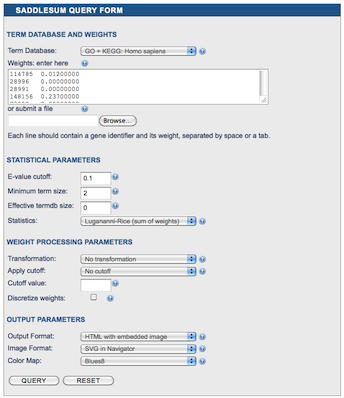
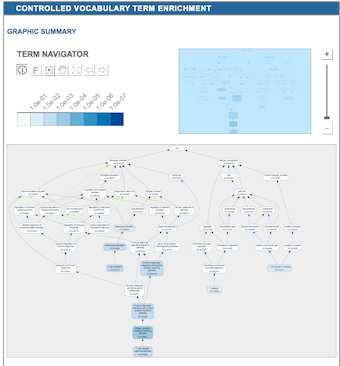
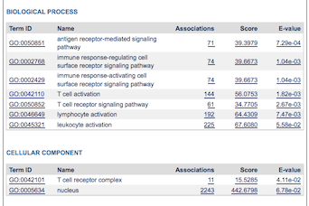
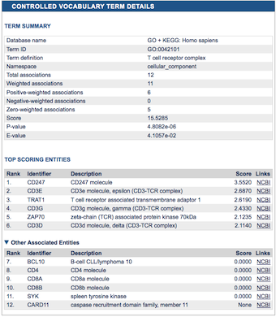
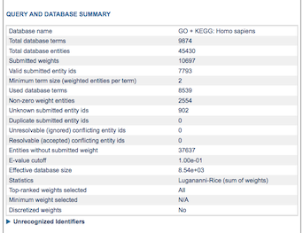

Web Service
===========

*SaddleSum* `web service </CBBresearch/Yu/mn/enrich/>`_
allows users to input their gene weights through a web form and
receive results as HTML pages. The user interface consists of the
input form, the output page and the term details page.

.. note::

 *SaddleSum* web service runs standalone executable on the
 server and hence many of its options directly correspond to the
 command line options described on the man page for the
 :ref:`command-line-label` program available as an Appendix. We
 will here concentrate mostly on the aspects unique to the web service.

Input Form
----------

Use the input form to set up *SaddleSum* queries. It consists of four
sections: term database and weights, statistical parameters, weight
processing parameters and output parameters.

The only mandatory parameters are located in the **Term Database and
Weights** section. You must choose an appropriate database from the
dropdown box and enter gene labels with their weights. Since all
databases that can be selected are in ETD format (see
:ref:`term-datasets-label`), you may enter gene labels as NCBI Gene
IDs, as canonical gene names or as aliases. There are two ways to
enter weights: through the text box or by uploading a text file. The
format is the same in both cases: it consists of several lines where
each line should contain a gene label string, followed by spaces or a
TAB, followed by a floating point weight value.

The **Statistical Parameters** determine which database terms are
retrieved as significant. These are E-value cutoff, minimum term size,
effective database size and statistical method. See
:ref:`statistics-label` for an explanation of *SaddleSum* statistics
and the :ref:`command-line-label` man page for the detailed
description of these options. Note that apart from the default
``Lugannani-Rice`` statistics, it is also possible to select ``One-sided
Fisher's Exact test`` statistics, which are based on the hypergeometric
distribution. In that case, you must select a cutoff under the
weight processing parameters.

The **Weight Processing Parameters** can be used to easily perform the
most common transformations of weights and set weight cutoffs. Again, the
:ref:`command-line-label` man page contains all the details about the
allowed values.

The look of the *SaddleSum* output is controlled through the **Output
Parameters** section. You can select the output format (``HTML``,
``text`` or ``tab``), the format of the term relationships graph image
(see below) and its color scheme. If you choose ``text`` or ``tab`` as
output format, *SaddleSum* will not produce a term relationship graph.

To run *SaddleSum* press the **QUERY** button.

Output Page
-----------

To display query results *SaddleSum* produces an output page showing
an image of the term relationships network, the tables listing
significant terms, and a query and database summary.

Term relationships network
^^^^^^^^^^^^^^^^^^^^^^^^^^

is placed at the top of the results. It contains terms as nodes linked
by their relationships supplied by the term database they belong to.
Of the databases currently by the web service, Gene
Ontology has term relationships as a directed acyclic graph, while
KEGG has a tree hierarchy. Only the significant terms according to the
E-value cutoff plus their hierarchical parents are shown. Term
significance (*log* E-value) is indicated by node colors. Clicking a
term node opens a new window or tab in the browser that show the
full description of the corresponding term.

Significant terms
^^^^^^^^^^^^^^^^^

are listed in the tables below the term graph. Each namespace with
significant terms has its own table. A namespace table shows for each
significant term its database identifier, description, the number of
associations with genes, score and E-value.

Clicking on term identifier opens a new window or tab in the browser
showing the full term description, while clicking on the last three
columns brings up a statistical summary of the term and a full list of
all genes associated with it together with their weights.

Query and database summary
^^^^^^^^^^^^^^^^^^^^^^^^^^

is placed at the bottom of the results page. It echoes most of the
input parameters, such as the name of the selected database,
statistical parameters and weight transformation. In addition, it
shows the statistics collected during the execution of the query that
depend on the actual submitted gene identifiers and weights. These
include the numbers of submitted and valid gene identifiers, total and
used terms, and unused gene identifiers. Finally, you can toggle a list
of unrecognized identifiers, if there were any.

Examples
--------

The page
https://www.ncbi.nlm.nih.gov/CBBresearch/Yu/mn/enrich/examples.html
contains links to three examples of collections of weights that could
be used with *SaddleSum*. The links lead to *SaddleSum* query forms
filled with the log2 ratios of gene expressions, taken from selected
microarrays from the
`NCBI GEO database </gds>`_.
These are the same weights available as examples for the command-line version
(:ref:`standalone-examples-label`). Once you reach the query
forms for an example, you only need to press the **QUERY** button to
run it and obtain the results.


..
   Local Variables:
   mode: rst
   indent-tabs-mode: nil
   sentence-end-double-space: t
   fill-column: 70
   End:
